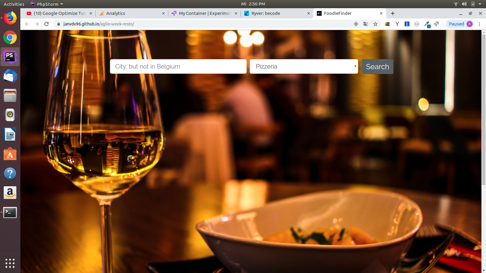

# JS-agile-week
# About Foodie Finder

Foodie Finder : is a very useful web page that returns the best restaurants in a city of your choice, respecting one of the restaurants catagories in the dropdown menue.

## why Foodie Finder ?
We are a foodie team we love food. one day we were thinking of  going out to eat, it's for sure you can search for that information on google but what if you want to be fast and specifick in one kind of food. With this website you will for sure not lose that much of time.

## Contact us FoodieFinder 
Location : The Beacon, Sint-Pietersvliet 7, 2000 Antwerpen
E-mail : foodiefinds19@gmail.com

## Bugs: 
unfortunatly we didnt find all the API's that has all the data we needed to cover all the cities around the world!

## A/B test
we have manged to do the (A/B) test to run our project in order to  make the best choices to our future users.

## Our team : 
#### Joseph Lindzius, Eloualid ghoulla, Jan Van Develde, Kevin Comyn, Rafah Alani 
