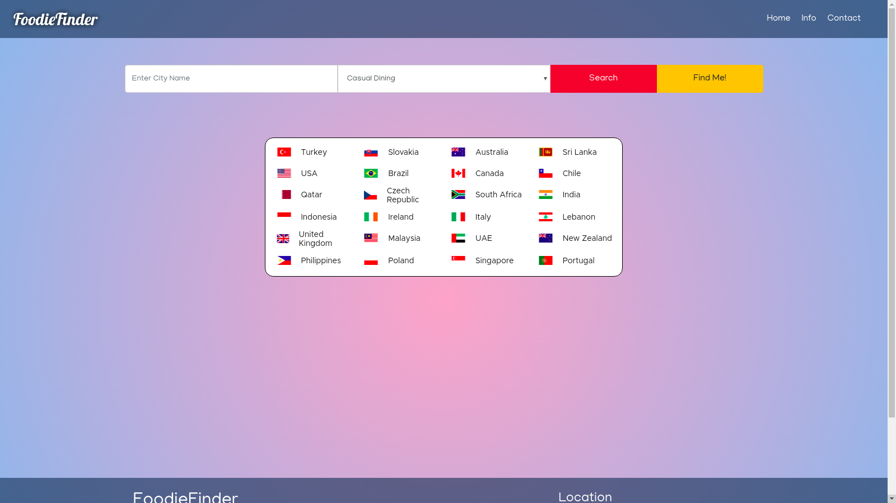

# FoodieFinder
### Are you trying to find the best restaurant in no time? 
### try our page: https://janvdv96.github.io/agile-week-resto/

## About 
 FoodieFinder: is a very useful web page that returns the best restaurants in a city of your choice, respecting one of the restaurants catagories in the dropdown menue.
 

## Idea 
The idea came to us because we are all a foodie team, we love food. One day we were thinking of going out to eat, it's for sure posiible that you search for that information on google but what if you want to be fast and specifick in one kind of food or restaurant. With this website you will for sure not lose that much of time.

## Bugs 
We started very ambitious and we tryed to find every Halal restaurant in a city and disabled accessible restaurants but we couldn't find any of those due to the data we have at the moment.
Unfortunatly we also didn't find all the API's that has all the data we needed to cover all the cities around the world!
Probably when we expand in our buisness we will be able to manage getting the right data with a payable amount of money.

## Contact us

Location : The Beacon, Sint-Pietersvliet 7, 2000 Antwerpen

E-mail : foodiefinds19@gmail.com

## A/B test
we have manged to do the (A/B) test to run our project in order to  make the best choices to our future users.

## Our team 
#### Joseph Lindzius, Eloualid ghoulla, Jan Van Develde, Kevin Comyn, Rafah Alani.

# Presentation

### Introduction
Welcome everyone to our presentation.  We would like to introduce you to our new product FoodieFinder--the finder for foodies.
Our concept developed from our first conversation together where we discussed our different interests.  Topics in that conversation included: advice and tips, latest technology, cocktail making, and cooking recipes.  This led us naturally to a discussion about the restaurant industry.  Our colleague Eloualid then brought forth the basic concept to the group, that was, a search engine for people who love food and discovering the best rated restaurants for them locally.  

### User Stories 
From there we developed user stories about people in different situtations looking to find a place to find food.  These stories included:

- I am on a budget and I want to eat good quality but the price must be cheap.
- I am vegan and I want to find vegan good so that I can find food.
- I am away on business and I want to eat quality food near my hotel with colleagues so that we can work over dinner.
- I am a traveler, I want to find the most exotic food available in the city I am in so that I can focus on my vacation instead of search hours for a restaurant on Google.
- I am mother of three and I want to eat quality food while on vacation so that it is kid-friendly and on a budget.
- I am not able to leave my house and I want to order food so that I can also enjoy good quality food.

### Features 
From these captivating stories we found our features.  

- Find the users location
- Find only the best quality (best-rated) restaurants.
- Show some information about price
- Ways of contacting the business - address and contact numbers
- A simple interface that everyone can use without being confused
- Create a style for the interface around the concept of quality.
- Create information pages for how to contact us.
- Show the quality of food directly to the user through use of photos

### Development

During the development we found ourselves swimming in a lake of resturant information APIs, of which, many did not work.  When we finally found a public API that worked we found it had limited information and broken websites.  We expanded our search from the Belgian market and looked into the global market and found an APIs where all of our features that we needed from our user stories could be found.  This API came from [Zomato.com](www.zomato.com). From there we found information over twenty countries such as Italy, India (the largest), and the United States.  There are over 1000 different cities and over 1,700,000 restaurants in total.  Those in the API have requested to Zomato to appear in their database.  On top of that API we found another from [OpenCageData.com](www.opencagedata.com), where we could convert the users geolocation found through the browser and convert it into a city name of the users current location.  This is where it got exciting.  We were able to display the users location and produce results (although hard coded coords since our API is not yet in covered in Belgian).  We added one last api from [Unsplash.com](https://unsplash.com), where the user receives a picture, if possible, of the city that the user has requested.

### Testing our Product

We attempted our AB testing using Google Optimization and found the process helpful in the sense we learned about a new process but the results were lacking.  We did find the personal comment the best insight.  The user did not find the city she was looking for because we did not tell the user that the app only works in specific locations.  We also found through the testing that our responsiveness of the page was not up to par and that we actually were not answering our user stories.  After more research into the API we were able to find all the information and even more than needed for a complete experience.

### Demonstration

Now we will show some responses from our app.

### Bugs and limitations

- We are limited by the number of countries from the API.
- Our app focused on mobile responsiveness so the experience for the desktop user may not be as pleasant.
- Some times pictures are not accurate do to a bug
- Things we planned but no time for....
    - Better formatting for information display (such as phone number clickablity)
    - adding button to lead to website
    
### Audit Results

Index
- Performance: 97 
- Accessiblity: 61
- Best Practices: 100
- SEO: 89
- Validation: OK

About Us

- Performance: 97
- Accessiblity: 90
- Best Practices: 86
- SEO: 64
- Validation: OK

Contact Page

- Performance: 99 
- Accessiblity: 72
- Best Practices: 100
- SEO: 60
- Validation: OK
